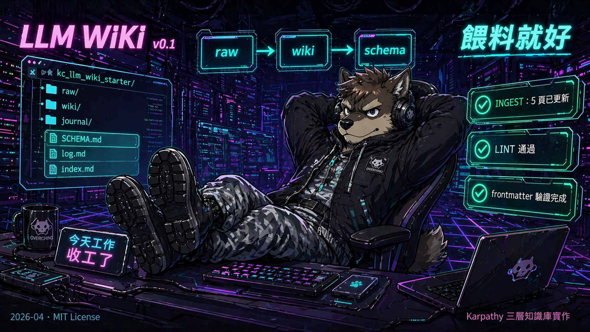

# AI 幫你養知識庫，你只要餵料

[](LICENSE)
[](https://commonmark.org/)
[](https://gist.github.com/karpathy/442a6bf555914893e9891c11519de94f)

[English](README.md)



你去年「這次要好好整理」了幾次的知識庫？對，這次不一樣 — 因為維護的人不是你。

基於 [Karpathy 2026-04 LLM Wiki gist](https://gist.github.com/karpathy/442a6bf555914893e9891c11519de94f) 的 production-ready template。三層架構（raw / wiki / schema）+ journal 本地 extension。Clone 回去、餵 doc、讓 LLM 做那些人類永遠做不完的 bookkeeping。

## 為何不用 Obsidian / Notion / Confluence 就好

那些工具假設**你**會維護知識庫。Cross-reference、摘要、矛盾、缺頁 — 總要有人保持一致性。人類 50 頁以後就放棄了。

LLM 不會放棄。這個 template 就是讓 LLM 幫你維護的結構。

- **LLM 維護成本近零**：不會忘記更新 cross-ref、不會厭倦做 bookkeeping
- **三層明確分工**：raw = 真實來源、wiki = LLM 整理、schema = 規則
- **Git native**：版本控制、diff、可 git-crypt 加密
- **無 vendor lock-in**：純 markdown，明天換 LLM / 換 tool 都帶走

## 快速開始

```bash
git clone https://github.com/YOUR/kc_llm_wiki_starter.git my-wiki
cd my-wiki
```

1. 改 `CLAUDE.md` / `README.md` / `index.md` / `log.md` 的 `{{ your-wiki-name }}` placeholder
2. 看 `wiki/_example_entity.md` 跟 `wiki/_example_overview.md` 學 frontmatter 格式
3. 砍 example 或保留當 template reference（底線前綴標示 non-real）
4. 開 Claude session，丟一份 doc 到 `raw/`，對 agent 說「ingest 這份到 wiki」

完整流程：[docs/getting-started.md](docs/getting-started.md)

## 核心概念（30 秒版）

```
raw/     ← 外部 dump（gitignored，不進 git）
wiki/    ← LLM 整理的主題頁（frontmatter + body）
journal/ ← 時序工作日誌（daily / meeting / checklist）
SCHEMA.md, log.md, index.md  ← meta 層
```

**三個 workflow**：

1. **Ingest**：新 raw doc → agent 跟你對焦關鍵 → 去敏後寫進 wiki → 更新 index + log
2. **Query**：問 agent → 他讀 index 決定查哪頁 → 讀 wiki → 回答含 citation
3. **Lint**：定期跑 `/llm-wiki-lint` → 抓 stale / orphan / missing / data gap

詳見 [docs/workflow.md](docs/workflow.md)。

## 搭配 Skill

推薦搭配 [`kc_ai_skills/llm-wiki-lint`](https://github.com/KerberosClaw/kc_ai_skills/tree/main/llm-wiki-lint)：

**為何需要**：wiki 超過 ~15 頁之後，stale claims（內文 vs raw 脫節）、orphan cross-refs（頁面孤立）、missing topic pages（應有但缺）、data gaps（`sources` 指向消失的 raw）會**默默腐爛**。人類自己不會發現，讀到出事才炸。llm-wiki-lint 每週跑一次抓 drift，讓 LLM 不會哪天自信地搬錯 fact 打臉你。

本 template 的 `CLAUDE.md` 已內建 session-start hygiene check — agent 每次 session 開始會檢查 `log.md` 最後 LINT 紀錄，超過 14 天主動提醒你跑 lint。

**Install**：

```bash
git clone https://github.com/KerberosClaw/kc_ai_skills.git
cp -r kc_ai_skills/llm-wiki-lint ~/.claude/skills/
```

## Security Notice

本 template 內**不含任何真實資料 / 憑證 / 外部依賴** — 單純 markdown scaffolding。但使用時注意：

- **你的 `raw/` 資料夾預設 gitignored**，不進 git。但放在本機磁碟，自己規劃 backup / 跨機同步策略
- **Commit message 不會被 git-crypt 加密**，即使啟用。敏感 entity name 不要寫 commit message
- **外部 LLM API**：agent 做 ingest / query 時內容會送到 LLM（Claude、GPT 等）。敏感資料投餵前先套用自己的 data classification policy
- **回報安全議題**：開 GitHub issue（本 template repo 預期只放非敏感內容）

## Documentation

- [docs/getting-started.md](docs/getting-started.md) — 5 分鐘第一次 ingest
- [docs/workflow.md](docs/workflow.md) — Ingest / Query / Lint 詳細流程
- [docs/extensions.md](docs/extensions.md) — 客製化方向（journal layer、frontmatter 擴展、工具整合）

## License

MIT — 見 [LICENSE](LICENSE)
